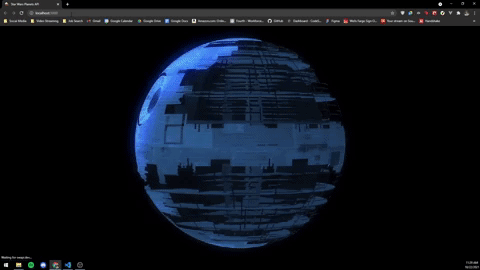

# Star Wars Planet Dashboard API

## Description:
This repository contains the development of a React web application designed to display data about the planets in the Star Wars Universe. 
<br></br>
Please Note: This application has not yet been deployed and can only run via local machine at http://localhost:3000 (default). 

<div align="center">
    
</div>

## Setup:
The environments and technologies used:
1. React v17.0.2 
2. JavaScript, HTML, CSS, Bootstrap 
3. Visual Studio Code, WSL 2 (Ubuntu 20.04.2 LTS)
4. node v14.16.0
5. npm 8.1.0

Clone this repository to the desired workspace path. 
Install the neccessary dependencies via npm: 
```
$ npm install
```
To start the server-side interface use the command:
```
$ npm start
```
If an 'Error: listen EADDRINUSE: address already in use :3000' occurs, simply kill all node processes before running 'npm start'. To do this use the command: 
```
$ killall -9 node
```
Run the command 'npm start' again after all node processes are stopped. This will start the development server and open a new browser where the application can be viewed at http://localhost:3000. 

## Project Development and Design Choices

### App.js 
To organize my applicaction, I wanted to encapsulate the project using a parent component (App.js) that would be able to pass down props such as ***data***, ***loading***, and ***chartData***. These would be used in child components -- called PlanetChart and PlanetTable -- to render information about the planets that would meet the requirements of the use of a bar graph and table respectively. 

I utilized React hooks and the fetch API to retrieve the Star Wars Planents data. To ensure that all of the results were fetched, the function fetchPlanetData() is a while loop that iterates through all of the API pages and stores the planet objects (which would be accessed at data.results after the Promise of the fetch is returned) in an array called ***planetData***. ***planetData*** is then sorted alphabetically first by flatting the array of arrays by calling flat() and then finally sorting in ascending order by calling sort(). After fetching and formatting my desired planet data I utilized useEffect to set the data state and loading state. ***data*** is the state that stores the sorted planets objects array and ***loading*** is a boolean state that allows me to   Finally, renderChart() is called which would set the chartData state which would pass the planet names and populations to be graphed on a bar chart via Chart js. 

### PlanetChart.js
The PlanetChart component uses react-chartjs-2 to render a bar graph where the X Axis is the Planet's name and the Y Axis is the Planet's population. At first glance, the data was so sparsed that only the larger populations would be displayed, leaving the planets with much smaller populations to be barely seen by the user. To display the data more effectively I made the y scale ticks to be logarithmic and added custom Y Axis labels to make the chart more readable. 

I was unable to implement the functionality of allowing the user to select from a planet's attributes to be graphed and displayed on a bar graph. An idea I had in mind for future development would be to utilize a select dropdown of the planent attribute options that would store the states of each graph and after the user selects an attribute they want to be displayed on the UI, the state would be updated and the graph would be rendered correctly via an onChange event. 

### PlanetTable.js
The PlanetTable component uses react-bootstrap-table-next and react-bootstrap-table2-paginator to render a table that records the attributes (Name, Population, Rotation Period, Orbital Period, Diameter, Climate, Surface Water) of each planet. react-bootstrap-table2-paginator allows for table pagination so the table displays 10 planets at a time and can be cycled through by clicking the interactive buttons found directly under the table. 

## Limitations 

The application was developed in the standard 1920x1080p viewport and was not developed for other screen size resolutions, thus it is best to view this application on a standard 1920x1080p screen. 